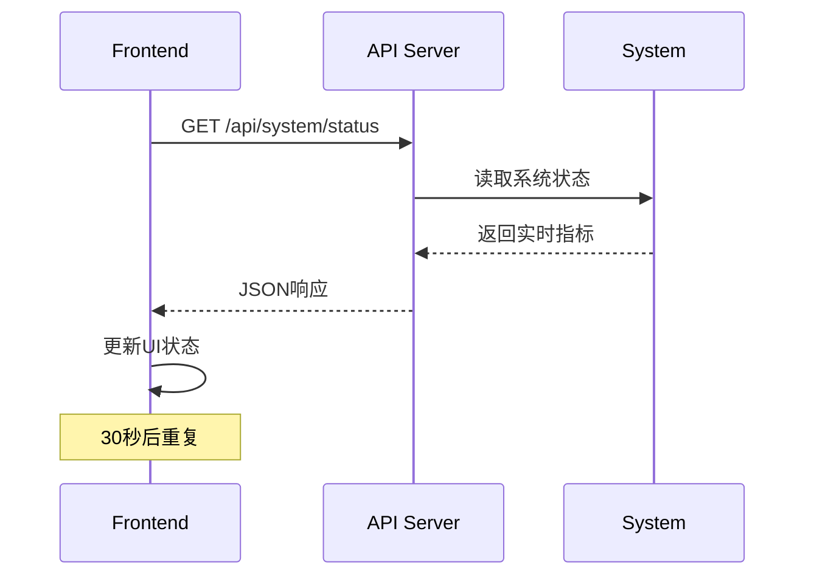

# 5.1套利系统技术文档

## 📋 目录
- [系统架构概览](#系统架构概览)
- [技术选型](#技术选型)
- [功能模块](#功能模块)
- [API接口文档](#API接口文档)
- [前后端交互逻辑](#前后端交互逻辑)
- [部署配置](#部署配置)
- [开发指南](#开发指南)

---

## 🏗 系统架构概览

### 整体架构
```
┌─────────────────────────────────────────────────────────────┐
│                    5.1套利系统架构                           │
├─────────────────────────────────────────────────────────────┤
│  前端层 (Frontend)                                          │
│  ├── React 18 + TypeScript                                 │
│  ├── Ant Design 5.x UI组件库                               │
│  ├── Redux Toolkit 状态管理                                │
│  ├── ECharts + Recharts 数据可视化                         │
│  └── Vite 构建工具                                         │
├─────────────────────────────────────────────────────────────┤
│  API层 (Backend API)                                       │
│  ├── Node.js + Express 服务器                              │
│  ├── RESTful API接口                                       │
│  ├── CORS跨域处理                                          │
│  └── 实时数据模拟                                          │
├─────────────────────────────────────────────────────────────┤
│  业务逻辑层 (Business Logic)                               │
│  ├── 系统控制模块 (System Control)                         │
│  ├── 清洗模块 (Data Processing)                            │
│  ├── 策略模块 (Strategy Engine)                            │
│  ├── 风险管理模块 (Risk Management)                        │
│  └── 架构监控模块 (Architecture Monitoring)               │
├─────────────────────────────────────────────────────────────┤
│  数据层 (Data Layer)                                       │
│  ├── 实时性能指标                                          │
│  ├── 系统运行状态                                          │
│  ├── 配置数据                                              │
│  └── 日志数据                                              │
└─────────────────────────────────────────────────────────────┘
```

### 部署架构
```
AWS EC2 实例 (57.183.21.242)
├── 前端服务 (Port 3000)
│   └── Vite Dev Server + React App
├── API服务 (Port 8080)  
│   └── Express Server + RESTful API
└── 监控终端
    └── Shell Script 实时监控
```

---

## 🛠 技术选型

### 前端技术栈
| 技术 | 版本 | 用途 | 选择原因 |
|------|------|------|----------|
| **React** | 18.2.0 | 前端框架 | 组件化开发，生态成熟，性能优良 |
| **TypeScript** | 5.0.2 | 类型系统 | 提高代码质量，减少运行时错误 |
| **Vite** | 4.4.5 | 构建工具 | 快速热更新，现代化构建流程 |
| **Ant Design** | 5.8.6 | UI组件库 | 企业级UI组件，丰富的组件生态 |
| **Redux Toolkit** | 1.9.5 | 状态管理 | 简化Redux使用，内置最佳实践 |
| **ECharts** | 5.4.3 | 数据可视化 | 强大的图表库，3D可视化支持 |
| **Recharts** | 2.8.0 | 图表组件 | React生态图表库，组件化使用 |
| **React Query** | 4.32.6 | 数据获取 | 服务端状态管理，缓存优化 |
| **Framer Motion** | 10.16.1 | 动画库 | 流畅的UI动画效果 |
| **TailwindCSS** | 3.3.3 | CSS框架 | 原子化CSS，快速样式开发 |

### 后端技术栈
| 技术 | 版本 | 用途 | 选择原因 |
|------|------|------|----------|
| **Node.js** | Latest | 运行时环境 | JavaScript全栈开发，异步I/O |
| **Express** | Latest | Web框架 | 轻量级，中间件生态丰富 |
| **CORS** | Latest | 跨域处理 | 解决前后端分离的跨域问题 |

### 开发工具
- **ESLint** - 代码规范检查
- **Prettier** - 代码格式化
- **Vitest** - 单元测试框架
- **Storybook** - 组件文档和测试

---

## 🎯 功能模块

### 1. 系统控制模块 (System Control)
**功能说明**: 核心系统启停控制和状态监控

**主要功能**:
- ✅ 系统启动/停止控制
- ✅ 实时系统状态监控
- ✅ 性能指标显示 (CPU、内存、网络延迟)
- ✅ 系统版本和运行时长统计
- ✅ 自动状态同步 (30秒间隔)

**技术实现**:
```typescript
// 核心状态接口
interface SystemStatus {
  status: 'running' | 'stopped' | 'unknown';
  uptime?: string;
  cpu_usage?: number;
  memory_usage?: number;
  network_latency?: number;
  version?: string;
  lastStarted?: string;
}

// API调用逻辑
const checkStatus = async () => {
  const response = await fetch(`${API_BASE_URL}/api/system/status`);
  const data = await response.json();
  // 状态更新逻辑...
};
```

### 2. 清洗模块 (QingXi - Data Processing)
**功能说明**: 数据收集器管理和数据清洗处理

**主要功能**:
- 📊 数据收集器状态监控
- 🔄 数据处理流程管理
- 📈 数据质量指标
- ⚙️ 收集器配置管理

**状态管理**:
```typescript
// Redux Store Slice
const qingxiSlice = createSlice({
  name: 'qingxi',
  initialState: {
    collectors: [],
    processing: false,
    metrics: null
  },
  reducers: {
    updateCollectorStatus,
    setProcessingState,
    updateMetrics
  }
});
```

### 3. 策略模块 (CeLue - Strategy Engine)  
**功能说明**: 套利策略配置和执行管理

**主要功能**:
- 📋 策略配置管理
- 🎯 策略执行监控
- 📊 策略性能分析
- 🔍 策略回测功能

### 4. 风险管理模块 (Risk Management)
**功能说明**: 实时风险监控和风险控制

**主要功能**:
- ⚠️ 实时风险指标监控
- 🛡️ 风险阈值设置
- 📈 风险趋势分析
- 🚨 风险预警机制

### 5. 架构监控模块 (Architecture Monitoring)
**功能说明**: 系统架构和微服务健康监控

**主要功能**:
- 🏗️ 系统架构可视化
- 💻 服务健康检查
- 📊 性能指标收集
- 🔧 系统诊断工具

### 6. 可观测性模块 (Observability)
**功能说明**: 系统可观测性和监控数据展示

**主要功能**:
- 📊 系统指标仪表盘
- 📝 日志聚合和分析
- 🔍 链路追踪
- 📈 性能基准测试

---

## 🔌 API接口文档

### 基础信息
- **Base URL**: `http://57.183.21.242:8080`
- **Content-Type**: `application/json`
- **CORS**: 支持跨域请求

### 1. 健康检查接口

#### GET /health
**用途**: 基础健康检查
```json
// Response
{
  "status": "ok",
  "timestamp": "2025-09-06T07:39:00.000Z",
  "version": "5.1.0"
}
```

#### GET /api/health  
**用途**: API服务健康检查
```json
// Response
{
  "status": "ok", 
  "timestamp": "2025-09-06T07:39:00.000Z",
  "version": "5.1.0"
}
```

### 2. 系统控制接口

#### GET /api/system/status
**用途**: 获取系统运行状态
```json
// Response
{
  "success": true,
  "data": {
    "isRunning": true,
    "lastStarted": "2025-09-06T07:39:28.712Z",
    "cpu_usage": 72.39,
    "memory_usage": 72.28,
    "network_latency": 10.49,
    "version": "5.1.0",
    "uptime": 0.003755,
    "modules": {
      "system": {"status": "running", "health": "healthy"},
      "qingxi": {"status": "running", "health": "healthy"},
      "celue": {"status": "running", "health": "healthy"},
      "risk": {"status": "running", "health": "healthy"}
    }
  }
}
```

#### POST /api/system/start
**用途**: 启动系统
```json
// Response (Success)
{
  "success": true,
  "message": "系统启动成功！",
  "data": {
    "status": "started",
    "message": "5.1套利系统已成功启动"
  }
}

// Response (Already Running)
{
  "success": true,
  "message": "系统已在运行中",
  "data": {
    "status": "already_running",
    "message": "系统已在运行状态"
  }
}
```

#### POST /api/system/stop
**用途**: 停止系统
```json
// Response (Success)
{
  "success": true,
  "message": "系统已停止",
  "data": {
    "status": "stopped",
    "message": "5.1套利系统已安全停止"
  }
}

// Response (Already Stopped)
{
  "success": true,
  "message": "系统已停止",
  "data": {
    "status": "not_running",
    "message": "系统已处于停止状态"
  }
}
```

#### GET /api/system/logs
**用途**: 获取系统日志
**参数**: `lines` (可选，默认50)
```json
// Response
{
  "success": true,
  "logs": [
    "2025-09-06 07:39:00 [INFO] ✅ 系统启动成功",
    "2025-09-06 07:39:01 [INFO] ✅ 所有模块已启动"
  ]
}
```

### 3. 风险管理接口

#### GET /api/risk/status
**用途**: 获取风险状态
```json
// Response
{
  "success": true,
  "data": {
    "level": "low",
    "fund_safety": true,
    "max_drawdown": 0.05,
    "current_exposure": 0.02
  }
}
```

### 4. 数据收集器接口

#### GET /api/qingxi/collectors/list
**用途**: 获取数据收集器列表
```json
// Response
[
  {
    "id": "collector_001",
    "name": "Binance数据收集器",
    "status": "running"
  },
  {
    "id": "collector_002", 
    "name": "OKX数据收集器",
    "status": "running"
  }
]
```

### 5. 配置管理接口

#### POST /api/config/update
**用途**: 更新系统配置
```json
// Request Body
{
  "module": "system",
  "config": {
    "key": "value"
  }
}

// Response
{
  "success": true,
  "message": "配置更新成功"
}
```

### 6. Systemd控制接口

#### POST /api/control/systemd/start
**用途**: 启动Systemd服务
```json
// Request Body
{
  "service": "arbitrage-system"
}

// Response
{
  "success": true,
  "message": "Systemd服务 arbitrage-system 启动成功"
}
```

#### GET /api/control/systemd/status
**用途**: 获取Systemd服务状态
```json
// Response
{
  "success": true,
  "data": {
    "name": "system",
    "status": "running",
    "health": "healthy",
    "metrics": {
      "cpu": 45.2,
      "memory": 67.8,
      "requests": 856
    }
  }
}
```

---

## 🔄 前后端交互逻辑

### 1. API地址配置策略
```typescript
// 智能API地址选择
const getAPIBaseURL = () => {
  if (window.location.hostname === '57.183.21.242') {
    return 'http://57.183.21.242:8080'; // AWS环境
  } else {
    return 'http://localhost:8080'; // 本地开发环境  
  }
};
```

### 2. 状态同步机制
```typescript
// 30秒自动同步
useEffect(() => {
  checkStatus(); // 初始检查
  
  const statusInterval = setInterval(() => {
    checkStatus();
  }, 30000);
  
  return () => clearInterval(statusInterval);
}, []);
```

### 3. 错误处理和重试逻辑
```typescript
const checkStatus = async () => {
  try {
    // 优先使用直接fetch请求
    const response = await fetch(`${API_BASE_URL}/api/system/status`);
    if (response.ok) {
      const data = await response.json();
      updateSystemStatus(data);
      return;
    }
  } catch (error) {
    console.error('❌ 直接fetch失败，尝试iframe方式:', error);
    // 回退到iframe + postMessage方式
    useIframeMethod();
  }
};
```

### 4. 跨域解决方案
- **CORS配置**: API服务器配置CORS允许前端域名
- **iframe回退**: 当CORS失败时，使用iframe + postMessage机制
- **GET方式支持**: 提供GET版本的启动/停止接口，绕过CORS限制

### 5. 实时数据更新流程


---

## 🚀 部署配置

### AWS EC2环境
- **实例地址**: 57.183.21.242
- **操作系统**: Linux 6.8.0-1036-aws  
- **端口配置**:
  - 3000: 前端开发服务器
  - 8080: API服务器
- **安全组配置**: 已开放3000和8080端口

### 本地开发环境
```bash
# 安装依赖
npm install

# 启动前端开发服务器
npm run dev

# 启动API服务器
node real-api-server.js

# 启动监控终端
./system-monitor.sh
```

### 环境变量配置
```bash
# 前端环境变量
VITE_API_BASE_URL=http://57.183.21.242:8080
VITE_TYPESCRIPT_CHECK=false

# API服务器环境变量  
PORT=8080
HOST=0.0.0.0
NODE_ENV=production
```

---

## 👨‍💻 开发指南

### 项目结构
```
arbitrage-frontend-v5.1/
├── src/
│   ├── components/          # 公共组件
│   │   ├── charts/         # 图表组件
│   │   ├── common/         # 通用组件
│   │   └── layout/         # 布局组件
│   ├── pages/              # 页面组件
│   │   ├── auth/           # 认证页面
│   │   ├── dashboard/      # 仪表盘
│   │   ├── qingxi/         # 清洗模块
│   │   ├── celue/          # 策略模块
│   │   ├── risk/           # 风险管理
│   │   ├── architecture/   # 架构监控
│   │   └── observability/ # 可观测性
│   ├── store/              # Redux状态管理
│   │   └── slices/         # Redux切片
│   ├── styles/             # 样式文件
│   ├── utils/              # 工具函数
│   └── types/              # TypeScript类型定义
├── real-api-server.js      # API服务器
├── system-monitor.sh       # 监控脚本
└── package.json            # 项目配置
```

### 添加新功能模块
1. **创建页面组件**: `src/pages/新模块/`
2. **创建状态切片**: `src/store/slices/新模块Slice.ts`
3. **注册路由**: 在路由配置中添加新页面
4. **添加API接口**: 在`real-api-server.js`中添加对应接口
5. **更新导航**: 在主布局中添加菜单项

### 状态管理模式
```typescript
// 创建新的Redux切片
const newModuleSlice = createSlice({
  name: 'newModule',
  initialState: {
    data: null,
    loading: false,
    error: null
  },
  reducers: {
    setLoading: (state, action) => {
      state.loading = action.payload;
    },
    setData: (state, action) => {
      state.data = action.payload;
      state.loading = false;
      state.error = null;
    },
    setError: (state, action) => {
      state.error = action.payload;
      state.loading = false;
    }
  }
});
```

### 组件开发规范
1. **使用TypeScript**: 所有组件必须有类型定义
2. **使用Ant Design**: 优先使用Ant Design组件
3. **响应式设计**: 支持移动端和桌面端
4. **错误边界**: 重要组件使用错误边界包装
5. **性能优化**: 使用React.memo和useMemo优化性能

### API接口开发
1. **RESTful设计**: 遵循REST API设计规范
2. **统一响应格式**: 使用统一的JSON响应结构
3. **错误处理**: 提供详细的错误信息和状态码
4. **CORS支持**: 配置适当的跨域策略
5. **日志记录**: 记录所有API请求和响应

---

## 🔧 当前实现状态

### ✅ 已实现功能
- [x] 系统启动/停止控制
- [x] 实时状态监控和性能指标显示
- [x] 30秒自动状态同步
- [x] 跨域问题解决方案
- [x] 错误处理和用户反馈
- [x] 响应式UI设计
- [x] TypeScript类型安全
- [x] 系统日志查看
- [x] 模块化架构设计
- [x] AWS云环境部署

### 🚧 开发中功能
- [ ] 数据收集器详细管理
- [ ] 策略配置界面
- [ ] 风险管理仪表盘
- [ ] 架构监控可视化
- [ ] 用户认证系统
- [ ] 系统配置管理

### 📋 待开发功能
- [ ] 实时WebSocket数据推送
- [ ] 数据可视化图表增强
- [ ] 移动端适配优化  
- [ ] 单元测试覆盖
- [ ] 性能监控和告警
- [ ] 多语言支持

---

## 📝 更新日志

### v2.1.0 (2025-09-06)
- ✅ 修复前端状态同步问题
- ✅ 优化API地址配置逻辑
- ✅ 增强错误处理和用户反馈
- ✅ 实现iframe + postMessage回退机制
- ✅ 添加实时性能指标显示
- ✅ 完善系统控制功能

### v2.0.0 (Initial Release)
- ✅ 基础系统架构搭建
- ✅ React + TypeScript前端框架
- ✅ Node.js + Express API服务器
- ✅ 模块化功能设计
- ✅ AWS云环境部署

---

## 🤝 贡献指南

### 开发流程
1. Fork项目到个人仓库
2. 创建功能分支: `git checkout -b feature/新功能`
3. 提交代码: `git commit -m 'Add: 新功能描述'`
4. 推送分支: `git push origin feature/新功能`
5. 创建Pull Request

### 代码规范
- 使用ESLint和Prettier进行代码格式化
- 遵循TypeScript最佳实践
- 添加必要的注释和文档
- 编写单元测试
- 提交信息使用约定式提交格式

---

## 📞 技术支持

### 联系方式
- **技术文档**: 本文档
- **API文档**: `/api/health` 接口可查看服务状态
- **监控面板**: `http://57.183.21.242:3000`
- **API服务**: `http://57.183.21.242:8080`

### 常见问题
1. **Q**: 前端页面显示空白？  
   **A**: 检查API服务是否正常启动，确认端口8080可访问

2. **Q**: API请求失败？  
   **A**: 检查CORS配置，确认防火墙设置正确

3. **Q**: 状态数据不更新？  
   **A**: 检查30秒自动同步是否正常工作，查看浏览器控制台错误

---

**文档版本**: v1.0  
**最后更新**: 2025-09-06  
**系统版本**: 5.1.0  