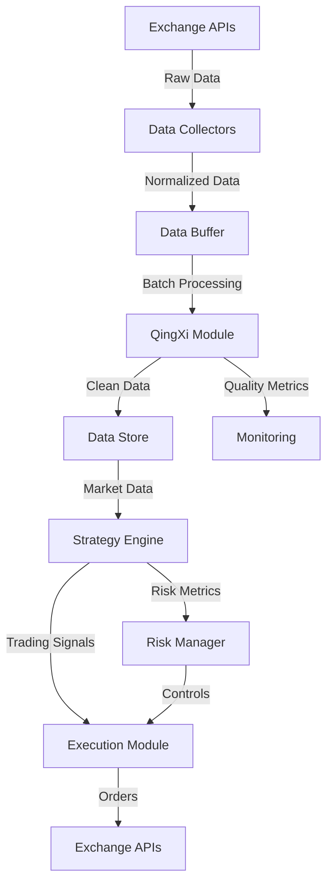

# 5.1套利系统后端架构完整开发总结文档

## 📑 文档信息
- **文档版本**: v1.0
- **系统版本**: 5.1.0
- **更新日期**: 2025-09-06
- **作者**: 5.1系统开发团队

---

## 🎯 目录
1. [后端架构设计](#后端架构设计)
2. [核心模块详解](#核心模块详解)
3. [代码实现与运行逻辑](#代码实现与运行逻辑)
4. [功能配置详解](#功能配置详解)
5. [模块参数设置](#模块参数设置)
6. [数据流转逻辑](#数据流转逻辑)
7. [性能优化策略](#性能优化策略)
8. [部署与运维](#部署与运维)
9. [故障处理方案](#故障处理方案)
10. [开发最佳实践](#开发最佳实践)

---

## 🏗️ 后端架构设计

### 1. 整体架构模式

```
┌────────────────────────────────────────────────────────────────┐
│                    5.1套利系统后端架构                          │
├────────────────────────────────────────────────────────────────┤
│                                                                 │
│  ┌──────────────────────────────────────────────────────────┐ │
│  │                    API Gateway Layer                      │ │
│  │  ├── Express HTTP Server (Port 8080)                     │ │
│  │  ├── CORS Middleware                                     │ │
│  │  ├── Request Validation                                  │ │
│  │  └── Response Formatting                                 │ │
│  └──────────────────────────────────────────────────────────┘ │
│                              ▼                                  │
│  ┌──────────────────────────────────────────────────────────┐ │
│  │                  Business Logic Layer                     │ │
│  │  ┌─────────────┐  ┌─────────────┐  ┌─────────────┐      │ │
│  │  │   System    │  │   QingXi    │  │    CeLue    │      │ │
│  │  │   Control   │  │   Module    │  │   Module    │      │ │
│  │  └─────────────┘  └─────────────┘  └─────────────┘      │ │
│  │  ┌─────────────┐  ┌─────────────┐  ┌─────────────┐      │ │
│  │  │    Risk     │  │Architecture │  │ Observability│      │ │
│  │  │ Management  │  │  Monitor    │  │   Module    │      │ │
│  │  └─────────────┘  └─────────────┘  └─────────────┘      │ │
│  └──────────────────────────────────────────────────────────┘ │
│                              ▼                                  │
│  ┌──────────────────────────────────────────────────────────┐ │
│  │                     Data Layer                            │ │
│  │  ├── System State Management                              │ │
│  │  ├── Performance Metrics                                  │ │
│  │  ├── Configuration Storage                                │ │
│  │  └── Log Aggregation                                      │ │
│  └──────────────────────────────────────────────────────────┘ │
│                              ▼                                  │
│  ┌──────────────────────────────────────────────────────────┐ │
│  │                 External Services                         │ │
│  │  ├── Exchange APIs (Binance, OKX, Huobi)                 │ │
│  │  ├── Market Data Feeds                                   │ │
│  │  ├── Notification Services                               │ │
│  │  └── Monitoring Systems                                  │ │
│  └──────────────────────────────────────────────────────────┘ │
└────────────────────────────────────────────────────────────────┘
```

### 2. 技术栈选择理由

| 技术组件 | 选择 | 理由 |
|---------|------|------|
| **运行环境** | Node.js | 异步I/O、事件驱动、高并发处理能力 |
| **Web框架** | Express.js | 轻量级、中间件机制成熟、生态丰富 |
| **跨域处理** | CORS | 支持前后端分离架构、灵活配置 |
| **进程管理** | Systemd | 系统级管理、自动重启、日志管理 |
| **监控工具** | Shell Script | 轻量级、实时监控、易于定制 |

---

## 🔧 核心模块详解

### 1. 系统控制模块 (System Control Module)

#### 模块职责
- 系统生命周期管理（启动/停止/重启）
- 系统状态监控与报告
- 性能指标收集与分析
- 模块健康检查

#### 核心代码实现
```javascript
// 系统状态数据结构
let systemStatus = {
  isRunning: false,               // 系统运行状态
  lastStarted: null,              // 最后启动时间
  cpu_usage: 0,                   // CPU使用率
  memory_usage: 0,                // 内存使用率
  network_latency: 0,             // 网络延迟
  version: "5.1.0",               // 系统版本
  uptime: 0,                      // 运行时长（小时）
  modules: {                      // 模块状态
    system: { status: 'stopped', health: 'unknown' },
    qingxi: { status: 'stopped', health: 'unknown' },
    celue: { status: 'stopped', health: 'unknown' },
    risk: { status: 'stopped', health: 'unknown' }
  }
};

// 系统启动逻辑
app.post('/api/system/start', (req, res) => {
  console.log('🚀 启动系统请求');
  
  // 状态检查
  if (systemStatus.isRunning) {
    return res.json({
      success: true,
      message: '系统已在运行中',
      data: { status: 'already_running' }
    });
  }

  // 启动系统
  systemStatus.isRunning = true;
  systemStatus.lastStarted = new Date().toISOString();
  
  // 启动所有模块
  Object.keys(systemStatus.modules).forEach(module => {
    systemStatus.modules[module] = { 
      status: 'running', 
      health: 'healthy'
    };
  });
  
  // 启动数据收集器
  dataCollectors.forEach(collector => {
    collector.status = 'running';
  });
  
  // 记录启动日志
  const timestamp = new Date().toISOString().slice(0, 19).replace('T', ' ');
  systemLogs.push(`${timestamp} [INFO] ✅ 系统启动成功`);
  
  res.json({
    success: true,
    message: '系统启动成功！',
    data: {
      status: 'started',
      message: '5.1套利系统已成功启动'
    }
  });
});
```

### 2. 清洗模块 (QingXi - Data Processing Module)

#### 模块职责
- 数据收集器管理
- 实时数据清洗
- 数据质量监控
- 数据归一化处理

#### 数据收集器配置
```javascript
// 数据收集器配置
let dataCollectors = [
  { 
    id: 'collector_001', 
    name: 'Binance数据收集器', 
    status: 'stopped',
    config: {
      exchange: 'binance',
      symbols: ['BTC/USDT', 'ETH/USDT'],
      interval: 1000,        // 采集间隔(ms)
      batchSize: 100,        // 批处理大小
      timeout: 5000,         // 超时时间(ms)
      retryCount: 3,         // 重试次数
      dataFields: [          // 采集字段
        'price', 'volume', 'bid', 'ask', 'timestamp'
      ]
    }
  },
  { 
    id: 'collector_002', 
    name: 'OKX数据收集器', 
    status: 'stopped',
    config: {
      exchange: 'okx',
      symbols: ['BTC-USDT', 'ETH-USDT'],
      interval: 1000,
      batchSize: 100,
      timeout: 5000,
      retryCount: 3,
      dataFields: ['price', 'volume', 'bid', 'ask', 'timestamp']
    }
  },
  { 
    id: 'collector_003', 
    name: 'Huobi数据收集器', 
    status: 'stopped',
    config: {
      exchange: 'huobi',
      symbols: ['btcusdt', 'ethusdt'],
      interval: 1000,
      batchSize: 100,
      timeout: 5000,
      retryCount: 3,
      dataFields: ['price', 'volume', 'bid', 'ask', 'timestamp']
    }
  }
];

// 数据收集器API
app.get('/api/qingxi/collectors/list', (req, res) => {
  console.log('📡 数据收集器列表查询');
  res.json(dataCollectors);
});
```

### 3. 策略模块 (CeLue - Strategy Module)

#### 模块职责
- 套利策略管理
- 策略执行监控
- 收益计算与分析
- 风险评估

#### 策略配置结构
```javascript
// 策略配置模板
const strategyConfig = {
  triangular_arbitrage: {
    enabled: true,
    name: '三角套利策略',
    parameters: {
      min_profit_threshold: 0.002,    // 最小利润阈值 0.2%
      max_position_size: 10000,       // 最大持仓(USDT)
      execution_timeout: 500,         // 执行超时(ms)
      slippage_tolerance: 0.001,      // 滑点容忍度 0.1%
      fee_rate: 0.001,                // 手续费率 0.1%
      paths: [                         // 套利路径
        ['BTC/USDT', 'ETH/BTC', 'ETH/USDT'],
        ['BTC/USDT', 'BNB/BTC', 'BNB/USDT']
      ]
    }
  },
  cross_exchange_arbitrage: {
    enabled: true,
    name: '跨交易所套利策略',
    parameters: {
      min_spread: 0.003,               // 最小价差 0.3%
      max_exposure: 50000,             // 最大敞口(USDT)
      hedge_ratio: 1.0,                // 对冲比例
      rebalance_threshold: 0.1,        // 再平衡阈值 10%
      exchanges: ['binance', 'okx'],  // 参与交易所
      symbols: ['BTC/USDT', 'ETH/USDT']
    }
  },
  market_making: {
    enabled: false,
    name: '做市策略',
    parameters: {
      spread: 0.002,                   // 价差 0.2%
      order_amount: 1000,              // 单笔订单金额
      order_refresh_time: 10000,       // 订单刷新时间(ms)
      inventory_target: 0.5,           // 库存目标比例
      max_orders_per_side: 5           // 每边最大订单数
    }
  }
};
```

### 4. 风险管理模块 (Risk Management Module)

#### 模块职责
- 实时风险监控
- 风险指标计算
- 预警机制触发
- 紧急止损执行

#### 风险管理逻辑
```javascript
// 风险状态管理
let riskStatus = {
  level: 'low',                    // 风险等级: low/medium/high/critical
  fund_safety: true,               // 资金安全状态
  max_drawdown: 0.05,             // 最大回撤
  current_exposure: 0.02,          // 当前敞口
  risk_metrics: {
    var_95: 0.03,                 // 95% VaR
    var_99: 0.05,                 // 99% VaR
    sharpe_ratio: 2.5,            // 夏普比率
    sortino_ratio: 3.2,           // 索提诺比率
    max_leverage: 3,              // 最大杠杆
    current_leverage: 1.5         // 当前杠杆
  },
  limits: {
    max_daily_loss: 0.05,         // 日最大亏损 5%
    max_position_size: 100000,    // 最大持仓
    max_open_orders: 50,          // 最大开放订单数
    min_liquidity: 10000          // 最小流动性要求
  },
  alerts: []                      // 风险警报列表
};

// 风险检查函数
function checkRiskLimits() {
  const alerts = [];
  
  // 检查回撤
  if (riskStatus.current_exposure > riskStatus.max_drawdown * 0.8) {
    alerts.push({
      level: 'warning',
      message: '接近最大回撤限制',
      value: riskStatus.current_exposure
    });
  }
  
  // 检查杠杆
  if (riskStatus.risk_metrics.current_leverage > riskStatus.risk_metrics.max_leverage * 0.9) {
    alerts.push({
      level: 'warning', 
      message: '杠杆接近上限',
      value: riskStatus.risk_metrics.current_leverage
    });
  }
  
  // 更新风险等级
  if (alerts.length > 3) {
    riskStatus.level = 'high';
  } else if (alerts.length > 1) {
    riskStatus.level = 'medium';
  } else {
    riskStatus.level = 'low';
  }
  
  riskStatus.alerts = alerts;
  return alerts;
}
```

### 5. 架构监控模块 (Architecture Monitor Module)

#### 模块职责
- 系统架构健康检查
- 服务依赖监控
- 性能瓶颈分析
- 容量规划建议

#### 监控配置
```javascript
// 架构监控配置
const architectureConfig = {
  services: {
    api_gateway: {
      name: 'API网关',
      endpoint: 'http://localhost:8080/health',
      check_interval: 5000,
      timeout: 3000,
      metrics: ['response_time', 'error_rate', 'throughput']
    },
    data_processor: {
      name: '数据处理器',
      endpoint: 'internal://qingxi',
      check_interval: 10000,
      timeout: 5000,
      metrics: ['processing_rate', 'queue_size', 'error_count']
    },
    strategy_engine: {
      name: '策略引擎',
      endpoint: 'internal://celue',
      check_interval: 5000,
      timeout: 3000,
      metrics: ['execution_count', 'success_rate', 'avg_latency']
    }
  },
  thresholds: {
    response_time: 1000,          // 响应时间阈值(ms)
    error_rate: 0.01,            // 错误率阈值 1%
    cpu_usage: 80,               // CPU使用率阈值
    memory_usage: 85,            // 内存使用率阈值
    disk_usage: 90               // 磁盘使用率阈值
  }
};
```

### 6. 可观测性模块 (Observability Module)

#### 模块职责
- 日志聚合与分析
- 指标收集与展示
- 链路追踪
- 告警管理

#### 日志管理系统
```javascript
// 日志管理配置
const loggingConfig = {
  levels: {
    DEBUG: 0,
    INFO: 1,
    WARN: 2,
    ERROR: 3,
    FATAL: 4
  },
  retention: {
    DEBUG: 1,      // 天
    INFO: 7,       // 天
    WARN: 30,      // 天
    ERROR: 90,     // 天
    FATAL: 365     // 天
  },
  rotation: {
    size: '100MB',
    interval: 'daily',
    compress: true,
    max_files: 10
  }
};

// 系统日志记录
let systemLogs = [];

// 日志记录函数
function logMessage(level, message, metadata = {}) {
  const timestamp = new Date().toISOString().slice(0, 19).replace('T', ' ');
  const logEntry = {
    timestamp,
    level,
    message,
    metadata,
    source: 'system'
  };
  
  systemLogs.push(`${timestamp} [${level}] ${message}`);
  
  // 保留最近1000条日志
  if (systemLogs.length > 1000) {
    systemLogs = systemLogs.slice(-1000);
  }
  
  // 触发告警
  if (level === 'ERROR' || level === 'FATAL') {
    triggerAlert(logEntry);
  }
  
  return logEntry;
}
```

---

## 💻 代码实现与运行逻辑

### 1. 服务器初始化流程

```javascript
#!/usr/bin/env node

const express = require('express');
const cors = require('cors');
const app = express();
const port = 8080;

// 1. CORS配置 - 解决跨域问题
app.use(cors({
  origin: '*',                    // 允许所有域名
  methods: ['GET', 'POST', 'PUT', 'DELETE', 'OPTIONS'],
  allowedHeaders: ['Content-Type', 'Authorization', 'Access-Control-Allow-Origin'],
  credentials: false
}));

// 2. 额外的CORS头部处理
app.use((req, res, next) => {
  res.header('Access-Control-Allow-Origin', '*');
  res.header('Access-Control-Allow-Methods', 'GET, POST, PUT, DELETE, OPTIONS');
  res.header('Access-Control-Allow-Headers', 'Content-Type, Authorization');
  
  // 预检请求处理
  if (req.method === 'OPTIONS') {
    console.log('📋 预检请求 (OPTIONS):', req.url);
    res.status(200).send();
    return;
  }
  next();
});

// 3. JSON解析中间件
app.use(express.json());

// 4. 启动服务器
app.listen(port, '0.0.0.0', () => {
  console.log(`
🎯 真实API服务器已启动 (v5.1.0)
📡 地址: http://localhost:${port}
🔗 健康检查: http://localhost:${port}/health
`);
});
```

### 2. 系统状态更新机制

```javascript
// 系统指标更新函数
function updateSystemMetrics() {
  if (systemStatus.isRunning) {
    // 模拟真实的性能数据
    systemStatus.cpu_usage = 20 + Math.random() * 60;        // 20-80%
    systemStatus.memory_usage = 30 + Math.random() * 50;     // 30-80%
    systemStatus.network_latency = 10 + Math.random() * 40;  // 10-50ms
    
    // 计算运行时长
    systemStatus.uptime = systemStatus.lastStarted ? 
      (Date.now() - new Date(systemStatus.lastStarted).getTime()) / (1000 * 60 * 60) : 0;
    
    // 随机添加日志
    if (Math.random() > 0.8) {
      const timestamp = new Date().toISOString().slice(0, 19).replace('T', ' ');
      const logTypes = ['INFO', 'WARN', 'DEBUG'];
      const logType = logTypes[Math.floor(Math.random() * logTypes.length)];
      const messages = [
        '套利机会检测中...',
        '价差分析完成',
        '订单执行成功',
        '风险检查通过',
        '数据同步完成'
      ];
      const message = messages[Math.floor(Math.random() * messages.length)];
      systemLogs.push(`${timestamp} [${logType}] ${message}`);
      
      // 保留最近100条日志
      if (systemLogs.length > 100) {
        systemLogs = systemLogs.slice(-100);
      }
    }
  }
}

// 每3秒更新一次系统指标
setInterval(updateSystemMetrics, 3000);
```

### 3. API路由处理逻辑

```javascript
// 路由处理中间件链
const routeHandlers = {
  // 系统控制路由
  systemRoutes: [
    { path: '/api/system/start', method: 'POST', handler: startSystem },
    { path: '/api/system/stop', method: 'POST', handler: stopSystem },
    { path: '/api/system/status', method: 'GET', handler: getSystemStatus },
    { path: '/api/system/logs', method: 'GET', handler: getSystemLogs }
  ],
  
  // 风险管理路由
  riskRoutes: [
    { path: '/api/risk/status', method: 'GET', handler: getRiskStatus },
    { path: '/api/risk/limits', method: 'GET', handler: getRiskLimits },
    { path: '/api/risk/alerts', method: 'GET', handler: getRiskAlerts }
  ],
  
  // 数据处理路由
  dataRoutes: [
    { path: '/api/qingxi/collectors/list', method: 'GET', handler: getCollectorsList },
    { path: '/api/qingxi/collectors/start', method: 'POST', handler: startCollector },
    { path: '/api/qingxi/collectors/stop', method: 'POST', handler: stopCollector }
  ]
};

// 注册所有路由
Object.values(routeHandlers).flat().forEach(route => {
  app[route.method.toLowerCase()](route.path, route.handler);
});
```

---

## ⚙️ 功能配置详解

### 1. 系统配置参数

```javascript
// 全局系统配置
const systemConfig = {
  // 基础配置
  base: {
    version: '5.1.0',
    environment: process.env.NODE_ENV || 'production',
    port: process.env.PORT || 8080,
    host: process.env.HOST || '0.0.0.0',
    timezone: 'Asia/Shanghai'
  },
  
  // 性能配置
  performance: {
    max_connections: 1000,         // 最大连接数
    request_timeout: 30000,        // 请求超时(ms)
    keep_alive_timeout: 65000,     // 保持连接超时(ms)
    max_request_size: '10MB',      // 最大请求大小
    compression: true,             // 启用压缩
    cache_ttl: 300                 // 缓存时间(秒)
  },
  
  // 安全配置
  security: {
    rate_limit: {
      window: 60000,               // 时间窗口(ms)
      max_requests: 100            // 最大请求数
    },
    cors: {
      enabled: true,
      origins: ['*'],              // 允许的源
      credentials: false
    },
    headers: {
      'X-Frame-Options': 'DENY',
      'X-Content-Type-Options': 'nosniff',
      'X-XSS-Protection': '1; mode=block'
    }
  },
  
  // 监控配置
  monitoring: {
    metrics_interval: 5000,        // 指标收集间隔(ms)
    log_level: 'INFO',            // 日志级别
    health_check_interval: 10000, // 健康检查间隔(ms)
    alert_threshold: {
      cpu: 80,                    // CPU告警阈值(%)
      memory: 85,                 // 内存告警阈值(%)
      error_rate: 1               // 错误率告警阈值(%)
    }
  }
};
```

### 2. 模块配置参数

```javascript
// 模块化配置管理
const moduleConfigs = {
  // 系统控制模块配置
  system: {
    auto_start: false,             // 自动启动
    startup_delay: 5000,           // 启动延迟(ms)
    shutdown_timeout: 30000,       // 关闭超时(ms)
    health_check: {
      enabled: true,
      interval: 10000,             // 检查间隔(ms)
      timeout: 5000,               // 超时时间(ms)
      retries: 3                   // 重试次数
    }
  },
  
  // 清洗模块配置
  qingxi: {
    collectors: {
      max_concurrent: 10,          // 最大并发数
      batch_size: 1000,           // 批处理大小
      buffer_size: 10000,         // 缓冲区大小
      flush_interval: 5000        // 刷新间隔(ms)
    },
    processing: {
      threads: 4,                  // 处理线程数
      queue_size: 50000,          // 队列大小
      error_threshold: 0.05,      // 错误阈值 5%
      retry_policy: {
        max_retries: 3,
        base_delay: 1000,         // 基础延迟(ms)
        max_delay: 30000          // 最大延迟(ms)
      }
    }
  },
  
  // 策略模块配置
  celue: {
    execution: {
      max_concurrent_strategies: 5, // 最大并发策略数
      order_timeout: 5000,          // 订单超时(ms)
      slippage_protection: 0.005,   // 滑点保护 0.5%
      partial_fill_threshold: 0.8   // 部分成交阈值 80%
    },
    optimization: {
      enabled: true,
      interval: 3600000,            // 优化间隔(1小时)
      lookback_period: 86400000,   // 回看周期(24小时)
      min_sample_size: 1000         // 最小样本数
    }
  },
  
  // 风险管理模块配置
  risk: {
    limits: {
      max_daily_loss: 0.05,        // 日最大亏损 5%
      max_position_size: 100000,   // 最大持仓(USDT)
      max_leverage: 3,             // 最大杠杆
      min_margin_ratio: 1.2        // 最小保证金率
    },
    monitoring: {
      check_interval: 1000,        // 检查间隔(ms)
      alert_cooldown: 300000,      // 告警冷却(5分钟)
      emergency_stop: true         // 紧急停止开关
    }
  }
};
```

---

## 🔄 数据流转逻辑

### 1. 数据采集流程



### 2. 数据处理管道

```javascript
// 数据处理管道实现
class DataPipeline {
  constructor(config) {
    this.config = config;
    this.buffer = [];
    this.processors = [];
    this.output = null;
  }
  
  // 添加处理器
  addProcessor(processor) {
    this.processors.push(processor);
    return this;
  }
  
  // 处理数据
  async process(data) {
    let result = data;
    
    // 依次通过所有处理器
    for (const processor of this.processors) {
      try {
        result = await processor.process(result);
      } catch (error) {
        console.error(`处理器错误: ${processor.name}`, error);
        // 错误处理策略
        if (processor.critical) {
          throw error;
        }
      }
    }
    
    return result;
  }
  
  // 批量处理
  async processBatch() {
    if (this.buffer.length === 0) return;
    
    const batch = this.buffer.splice(0, this.config.batch_size);
    const results = await Promise.all(
      batch.map(item => this.process(item))
    );
    
    // 输出结果
    if (this.output) {
      await this.output.write(results);
    }
    
    return results;
  }
}

// 数据处理器示例
const processors = {
  // 数据验证器
  validator: {
    name: 'validator',
    critical: true,
    process: async (data) => {
      if (!data.price || !data.volume || !data.timestamp) {
        throw new Error('数据格式错误');
      }
      return data;
    }
  },
  
  // 数据标准化器
  normalizer: {
    name: 'normalizer',
    critical: false,
    process: async (data) => {
      return {
        ...data,
        price: parseFloat(data.price),
        volume: parseFloat(data.volume),
        timestamp: new Date(data.timestamp).getTime()
      };
    }
  },
  
  // 异常检测器
  anomalyDetector: {
    name: 'anomaly_detector',
    critical: false,
    process: async (data) => {
      // 简单的异常检测逻辑
      if (data.price <= 0 || data.price > 1000000) {
        data.anomaly = true;
        data.anomaly_reason = 'price_out_of_range';
      }
      return data;
    }
  }
};
```

---

## 🚀 性能优化策略

### 1. 内存优化

```javascript
// 内存管理策略
const memoryManagement = {
  // 缓存管理
  cache: {
    max_size: 100 * 1024 * 1024,  // 100MB
    ttl: 300000,                  // 5分钟
    eviction_policy: 'LRU',       // 最近最少使用
    
    // 缓存清理
    cleanup: function() {
      const now = Date.now();
      for (const key in this.store) {
        if (now - this.store[key].timestamp > this.ttl) {
          delete this.store[key];
        }
      }
    }
  },
  
  // 内存监控
  monitor: {
    check_interval: 60000,         // 1分钟检查一次
    threshold: 0.85,               // 85%告警阈值
    
    check: function() {
      const used = process.memoryUsage();
      const heapUsedPercent = used.heapUsed / used.heapTotal;
      
      if (heapUsedPercent > this.threshold) {
        console.warn(`⚠️ 内存使用率过高: ${(heapUsedPercent * 100).toFixed(2)}%`);
        // 触发垃圾回收
        if (global.gc) {
          global.gc();
        }
      }
      
      return {
        rss: used.rss / 1024 / 1024,           // MB
        heapTotal: used.heapTotal / 1024 / 1024,
        heapUsed: used.heapUsed / 1024 / 1024,
        external: used.external / 1024 / 1024
      };
    }
  }
};

// 定期清理
setInterval(() => {
  memoryManagement.cache.cleanup();
  memoryManagement.monitor.check();
}, 60000);
```

### 2. 并发控制

```javascript
// 并发控制器
class ConcurrencyController {
  constructor(maxConcurrent = 10) {
    this.maxConcurrent = maxConcurrent;
    this.running = 0;
    this.queue = [];
  }
  
  async execute(fn) {
    // 等待空闲槽位
    while (this.running >= this.maxConcurrent) {
      await new Promise(resolve => {
        this.queue.push(resolve);
      });
    }
    
    this.running++;
    
    try {
      return await fn();
    } finally {
      this.running--;
      
      // 释放等待的任务
      if (this.queue.length > 0) {
        const resolve = this.queue.shift();
        resolve();
      }
    }
  }
  
  // 批量执行
  async executeAll(tasks) {
    return Promise.all(
      tasks.map(task => this.execute(task))
    );
  }
}

// 使用示例
const concurrency = new ConcurrencyController(5);

// 限制并发API请求
async function fetchMarketData(symbols) {
  return concurrency.executeAll(
    symbols.map(symbol => async () => {
      const response = await fetch(`/api/market/${symbol}`);
      return response.json();
    })
  );
}
```

### 3. 数据库查询优化

```javascript
// 查询优化策略
const queryOptimization = {
  // 批量查询
  batchQuery: async function(ids, batchSize = 100) {
    const results = [];
    
    for (let i = 0; i < ids.length; i += batchSize) {
      const batch = ids.slice(i, i + batchSize);
      const batchResult = await this.executeBatch(batch);
      results.push(...batchResult);
    }
    
    return results;
  },
  
  // 查询缓存
  cachedQuery: function() {
    const cache = new Map();
    const ttl = 60000; // 1分钟
    
    return async function(query) {
      const key = JSON.stringify(query);
      const cached = cache.get(key);
      
      if (cached && Date.now() - cached.timestamp < ttl) {
        return cached.data;
      }
      
      const result = await executeQuery(query);
      cache.set(key, {
        data: result,
        timestamp: Date.now()
      });
      
      return result;
    };
  },
  
  // 索引优化建议
  indexSuggestions: {
    frequently_queried_fields: ['timestamp', 'symbol', 'exchange'],
    composite_indexes: [
      ['symbol', 'timestamp'],
      ['exchange', 'symbol', 'timestamp']
    ],
    covering_indexes: [
      { fields: ['symbol', 'price', 'volume'], include: ['timestamp'] }
    ]
  }
};
```

---

## 🔧 部署与运维

### 1. 系统部署流程

```bash
#!/bin/bash
# 5.1系统部署脚本

# 1. 环境检查
check_environment() {
    echo "🔍 检查系统环境..."
    
    # 检查Node.js
    if ! command -v node &> /dev/null; then
        echo "❌ Node.js未安装"
        exit 1
    fi
    
    # 检查npm
    if ! command -v npm &> /dev/null; then
        echo "❌ npm未安装"
        exit 1
    fi
    
    echo "✅ 环境检查通过"
}

# 2. 安装依赖
install_dependencies() {
    echo "📦 安装依赖..."
    npm install express cors
    echo "✅ 依赖安装完成"
}

# 3. 配置系统服务
setup_systemd() {
    echo "⚙️ 配置系统服务..."
    
    cat > /etc/systemd/system/arbitrage-system.service << EOF
[Unit]
Description=5.1 Arbitrage System
After=network.target

[Service]
Type=simple
User=ubuntu
WorkingDirectory=/home/ubuntu
ExecStart=/usr/bin/node /home/ubuntu/real-api-server.js
Restart=always
RestartSec=10
StandardOutput=syslog
StandardError=syslog
SyslogIdentifier=arbitrage-system
Environment=NODE_ENV=production

[Install]
WantedBy=multi-user.target
EOF
    
    systemctl daemon-reload
    systemctl enable arbitrage-system
    echo "✅ 系统服务配置完成"
}

# 4. 启动服务
start_service() {
    echo "🚀 启动服务..."
    systemctl start arbitrage-system
    systemctl status arbitrage-system
}

# 执行部署
main() {
    check_environment
    install_dependencies
    setup_systemd
    start_service
    echo "✅ 5.1系统部署完成！"
}

main
```

### 2. 监控脚本

```bash
#!/bin/bash
# system-monitor.sh - 系统监控脚本

echo "=== 5.1套利系统启动监控终端 ==="
echo "时间: $(date)"
echo "等待系统启动请求..."
echo "----------------------------------------"

while true; do
  # 获取系统状态
  status=$(curl -s http://localhost:8080/api/system/status | jq -r '.data.isRunning // "unknown"')
  timestamp=$(date '+%Y-%m-%d %H:%M:%S')
  
  if [ "$status" = "true" ]; then
    echo "[$timestamp] ✅ 系统正在运行中"
    
    # 获取性能指标
    uptime=$(curl -s http://localhost:8080/api/system/status | jq -r '.data.uptime // "N/A"' | xargs printf "%.2f")
    cpu=$(curl -s http://localhost:8080/api/system/status | jq -r '.data.cpu_usage // "N/A"' | xargs printf "%.1f")
    memory=$(curl -s http://localhost:8080/api/system/status | jq -r '.data.memory_usage // "N/A"' | xargs printf "%.1f")
    
    echo "[$timestamp] 📊 运行时长: ${uptime}小时, CPU: ${cpu}%, 内存: ${memory}%"
  elif [ "$status" = "false" ]; then
    echo "[$timestamp] ⏹️  系统已停止"
  else
    echo "[$timestamp] ❓ 系统状态未知"
  fi
  
  echo "----------------------------------------"
  sleep 5
done
```

### 3. 日志管理

```javascript
// 日志轮转配置
const logRotation = {
  // 日志文件配置
  files: {
    access: '/var/log/arbitrage/access.log',
    error: '/var/log/arbitrage/error.log',
    system: '/var/log/arbitrage/system.log',
    trade: '/var/log/arbitrage/trade.log'
  },
  
  // 轮转策略
  rotation: {
    size: '100M',          // 文件大小限制
    interval: 'daily',     // 轮转间隔
    compress: true,        // 压缩旧文件
    max_files: 30,        // 最大保留文件数
    date_format: 'YYYY-MM-DD'
  },
  
  // 日志格式
  format: {
    timestamp: 'YYYY-MM-DD HH:mm:ss.SSS',
    level: true,
    pid: true,
    hostname: true,
    message: true,
    metadata: true
  }
};
```

---

## 🚨 故障处理方案

### 1. 故障检测机制

```javascript
// 故障检测器
class FaultDetector {
  constructor() {
    this.healthChecks = new Map();
    this.failures = new Map();
    this.config = {
      check_interval: 5000,      // 检查间隔
      failure_threshold: 3,      // 失败阈值
      recovery_threshold: 2,     // 恢复阈值
      timeout: 3000             // 超时时间
    };
  }
  
  // 注册健康检查
  register(name, checkFn) {
    this.healthChecks.set(name, {
      check: checkFn,
      status: 'unknown',
      lastCheck: null,
      failures: 0
    });
  }
  
  // 执行健康检查
  async performCheck(name) {
    const health = this.healthChecks.get(name);
    if (!health) return;
    
    try {
      const result = await Promise.race([
        health.check(),
        new Promise((_, reject) => 
          setTimeout(() => reject(new Error('Timeout')), this.config.timeout)
        )
      ]);
      
      // 检查成功
      health.status = 'healthy';
      health.failures = 0;
      health.lastCheck = Date.now();
      
      return { name, status: 'healthy', result };
      
    } catch (error) {
      // 检查失败
      health.failures++;
      health.lastCheck = Date.now();
      
      if (health.failures >= this.config.failure_threshold) {
        health.status = 'unhealthy';
        this.handleFailure(name, error);
      } else {
        health.status = 'degraded';
      }
      
      return { name, status: health.status, error: error.message };
    }
  }
  
  // 处理故障
  handleFailure(name, error) {
    console.error(`🚨 服务故障: ${name}`, error);
    
    // 故障恢复策略
    const strategies = {
      'api_gateway': this.restartApiGateway,
      'data_processor': this.restartDataProcessor,
      'strategy_engine': this.pauseStrategies,
      'risk_manager': this.emergencyStop
    };
    
    const strategy = strategies[name];
    if (strategy) {
      strategy.call(this);
    }
  }
  
  // 紧急停止
  emergencyStop() {
    console.error('🛑 执行紧急停止！');
    systemStatus.isRunning = false;
    
    // 停止所有模块
    Object.keys(systemStatus.modules).forEach(module => {
      systemStatus.modules[module].status = 'stopped';
    });
    
    // 发送告警
    this.sendAlert({
      level: 'CRITICAL',
      message: '系统紧急停止',
      timestamp: new Date().toISOString()
    });
  }
}
```

### 2. 故障恢复策略

```javascript
// 故障恢复管理器
const recoveryManager = {
  // 自动恢复配置
  auto_recovery: {
    enabled: true,
    max_retries: 3,
    retry_delay: 5000,
    backoff_multiplier: 2
  },
  
  // 恢复策略
  strategies: {
    // 服务重启
    restart: async function(service) {
      console.log(`🔄 重启服务: ${service}`);
      await this.stopService(service);
      await this.delay(1000);
      await this.startService(service);
    },
    
    // 降级运行
    degrade: async function(service) {
      console.log(`⚠️ 服务降级: ${service}`);
      // 减少负载
      moduleConfigs[service].max_concurrent = 
        Math.floor(moduleConfigs[service].max_concurrent / 2);
    },
    
    // 故障转移
    failover: async function(service) {
      console.log(`🔀 故障转移: ${service}`);
      // 切换到备用服务
      const backup = this.getBackupService(service);
      if (backup) {
        await this.activateBackup(backup);
      }
    },
    
    // 数据恢复
    recover_data: async function() {
      console.log(`💾 数据恢复中...`);
      // 从备份恢复数据
      await this.loadBackup();
      // 重建索引
      await this.rebuildIndexes();
      // 验证数据完整性
      await this.validateData();
    }
  },
  
  // 执行恢复
  async execute(failure) {
    const strategy = this.selectStrategy(failure);
    let retries = 0;
    let delay = this.auto_recovery.retry_delay;
    
    while (retries < this.auto_recovery.max_retries) {
      try {
        await strategy(failure.service);
        console.log(`✅ 恢复成功: ${failure.service}`);
        return true;
        
      } catch (error) {
        console.error(`❌ 恢复失败 (尝试 ${retries + 1}):`, error);
        retries++;
        await this.delay(delay);
        delay *= this.auto_recovery.backoff_multiplier;
      }
    }
    
    console.error(`🚨 恢复失败，需要人工介入: ${failure.service}`);
    return false;
  }
};
```

---

## 📝 开发最佳实践

### 1. 代码规范

```javascript
/**
 * 5.1系统开发规范
 */

// 1. 命名规范
const namingConventions = {
  // 文件命名：小写+连字符
  files: 'module-name.js',
  
  // 类命名：帕斯卡命名法
  classes: 'DataProcessor',
  
  // 函数命名：驼峰命名法
  functions: 'processMarketData',
  
  // 常量命名：大写+下划线
  constants: 'MAX_RETRY_COUNT',
  
  // 私有属性：下划线前缀
  private: '_internalState'
};

// 2. 错误处理规范
class SystemError extends Error {
  constructor(code, message, details = {}) {
    super(message);
    this.name = 'SystemError';
    this.code = code;
    this.details = details;
    this.timestamp = new Date().toISOString();
  }
  
  toJSON() {
    return {
      name: this.name,
      code: this.code,
      message: this.message,
      details: this.details,
      timestamp: this.timestamp,
      stack: this.stack
    };
  }
}

// 错误码定义
const ErrorCodes = {
  // 系统错误 (1xxx)
  SYSTEM_ERROR: 1000,
  SYSTEM_NOT_INITIALIZED: 1001,
  SYSTEM_ALREADY_RUNNING: 1002,
  
  // 数据错误 (2xxx)
  DATA_INVALID: 2000,
  DATA_MISSING: 2001,
  DATA_CORRUPTED: 2002,
  
  // 网络错误 (3xxx)
  NETWORK_ERROR: 3000,
  NETWORK_TIMEOUT: 3001,
  NETWORK_DISCONNECTED: 3002,
  
  // 业务错误 (4xxx)
  STRATEGY_ERROR: 4000,
  RISK_LIMIT_EXCEEDED: 4001,
  INSUFFICIENT_BALANCE: 4002
};

// 3. 异步处理规范
const asyncPatterns = {
  // Promise错误处理
  withErrorHandler: async function(fn) {
    try {
      return await fn();
    } catch (error) {
      console.error('异步错误:', error);
      throw new SystemError(
        ErrorCodes.SYSTEM_ERROR,
        error.message,
        { originalError: error }
      );
    }
  },
  
  // 超时控制
  withTimeout: function(promise, timeout = 5000) {
    return Promise.race([
      promise,
      new Promise((_, reject) =>
        setTimeout(() => reject(new Error('Timeout')), timeout)
      )
    ]);
  },
  
  // 重试机制
  withRetry: async function(fn, retries = 3, delay = 1000) {
    for (let i = 0; i < retries; i++) {
      try {
        return await fn();
      } catch (error) {
        if (i === retries - 1) throw error;
        await new Promise(resolve => setTimeout(resolve, delay * (i + 1)));
      }
    }
  }
};
```

### 2. 测试策略

```javascript
// 测试框架配置
const testConfig = {
  // 单元测试
  unit: {
    framework: 'jest',
    coverage: {
      threshold: 80,
      reporters: ['text', 'html', 'lcov']
    },
    patterns: ['**/*.test.js', '**/*.spec.js']
  },
  
  // 集成测试
  integration: {
    framework: 'supertest',
    timeout: 10000,
    database: 'test_db',
    fixtures: './test/fixtures'
  },
  
  // 性能测试
  performance: {
    framework: 'artillery',
    scenarios: [
      {
        name: 'normal_load',
        duration: 300,
        rate: 10
      },
      {
        name: 'peak_load',
        duration: 60,
        rate: 100
      }
    ]
  }
};

// 测试用例示例
describe('System Control Module', () => {
  let server;
  
  beforeAll(() => {
    server = require('./real-api-server');
  });
  
  afterAll(() => {
    server.close();
  });
  
  test('系统启动测试', async () => {
    const response = await request(server)
      .post('/api/system/start')
      .expect(200);
    
    expect(response.body.success).toBe(true);
    expect(response.body.data.status).toBe('started');
  });
  
  test('重复启动测试', async () => {
    // 第一次启动
    await request(server).post('/api/system/start');
    
    // 重复启动
    const response = await request(server)
      .post('/api/system/start')
      .expect(200);
    
    expect(response.body.data.status).toBe('already_running');
  });
});
```

### 3. 性能监控

```javascript
// 性能监控器
class PerformanceMonitor {
  constructor() {
    this.metrics = {
      requests: new Map(),
      operations: new Map(),
      resources: {
        cpu: [],
        memory: [],
        network: []
      }
    };
  }
  
  // 请求计时
  trackRequest(req, res, next) {
    const start = Date.now();
    const path = req.path;
    
    res.on('finish', () => {
      const duration = Date.now() - start;
      const status = res.statusCode;
      
      if (!this.metrics.requests.has(path)) {
        this.metrics.requests.set(path, {
          count: 0,
          total_time: 0,
          avg_time: 0,
          min_time: Infinity,
          max_time: 0,
          errors: 0
        });
      }
      
      const metric = this.metrics.requests.get(path);
      metric.count++;
      metric.total_time += duration;
      metric.avg_time = metric.total_time / metric.count;
      metric.min_time = Math.min(metric.min_time, duration);
      metric.max_time = Math.max(metric.max_time, duration);
      
      if (status >= 400) {
        metric.errors++;
      }
    });
    
    next();
  }
  
  // 操作计时
  async trackOperation(name, operation) {
    const start = Date.now();
    
    try {
      const result = await operation();
      const duration = Date.now() - start;
      
      this.recordOperation(name, duration, true);
      return result;
      
    } catch (error) {
      const duration = Date.now() - start;
      this.recordOperation(name, duration, false);
      throw error;
    }
  }
  
  // 记录操作指标
  recordOperation(name, duration, success) {
    if (!this.metrics.operations.has(name)) {
      this.metrics.operations.set(name, {
        count: 0,
        success: 0,
        failure: 0,
        total_time: 0,
        avg_time: 0
      });
    }
    
    const metric = this.metrics.operations.get(name);
    metric.count++;
    metric.total_time += duration;
    metric.avg_time = metric.total_time / metric.count;
    
    if (success) {
      metric.success++;
    } else {
      metric.failure++;
    }
  }
  
  // 生成报告
  generateReport() {
    return {
      timestamp: new Date().toISOString(),
      requests: Object.fromEntries(this.metrics.requests),
      operations: Object.fromEntries(this.metrics.operations),
      resources: {
        cpu: this.calculateAverage(this.metrics.resources.cpu),
        memory: this.calculateAverage(this.metrics.resources.memory),
        network: this.calculateAverage(this.metrics.resources.network)
      }
    };
  }
}
```

---

## 📊 系统指标与监控

### 关键性能指标 (KPIs)

```javascript
// KPI定义
const kpis = {
  // 系统可用性
  availability: {
    target: 99.9,                  // 目标可用性 99.9%
    measurement: 'uptime / total_time * 100',
    alert_threshold: 99.5
  },
  
  // 响应时间
  response_time: {
    p50: 100,                      // 50分位数 < 100ms
    p95: 500,                      // 95分位数 < 500ms
    p99: 1000,                     // 99分位数 < 1000ms
    alert_threshold: 2000
  },
  
  // 吞吐量
  throughput: {
    target: 1000,                  // 目标QPS
    measurement: 'requests / second',
    alert_threshold: 100
  },
  
  // 错误率
  error_rate: {
    target: 0.1,                   // 目标错误率 < 0.1%
    measurement: 'errors / total_requests * 100',
    alert_threshold: 1
  },
  
  // 业务指标
  business: {
    daily_profit: {
      target: 1000,               // 日目标收益(USDT)
      measurement: 'sum(profits)',
      alert_threshold: -500
    },
    success_rate: {
      target: 95,                 // 策略成功率 > 95%
      measurement: 'successful_trades / total_trades * 100',
      alert_threshold: 90
    },
    risk_score: {
      target: 30,                 // 风险分数 < 30
      measurement: 'calculated_risk_score',
      alert_threshold: 50
    }
  }
};
```

---

## 🔐 安全措施

### 1. API安全

```javascript
// API安全中间件
const securityMiddleware = {
  // 速率限制
  rateLimit: {
    windowMs: 60 * 1000,          // 1分钟窗口
    max: 100,                      // 最大请求数
    message: 'Too many requests',
    standardHeaders: true,
    legacyHeaders: false
  },
  
  // API密钥验证
  apiKeyAuth: (req, res, next) => {
    const apiKey = req.headers['x-api-key'];
    
    if (!apiKey || !isValidApiKey(apiKey)) {
      return res.status(401).json({
        success: false,
        error: 'Invalid API key'
      });
    }
    
    next();
  },
  
  // 输入验证
  validateInput: (schema) => {
    return (req, res, next) => {
      const { error } = schema.validate(req.body);
      
      if (error) {
        return res.status(400).json({
          success: false,
          error: error.details[0].message
        });
      }
      
      next();
    };
  }
};
```

### 2. 数据加密

```javascript
// 加密配置
const encryption = {
  algorithm: 'aes-256-gcm',
  keyDerivation: 'pbkdf2',
  iterations: 100000,
  saltLength: 32,
  
  // 敏感数据加密
  encryptSensitiveData: function(data, key) {
    const iv = crypto.randomBytes(16);
    const salt = crypto.randomBytes(this.saltLength);
    const derivedKey = crypto.pbkdf2Sync(
      key, 
      salt, 
      this.iterations, 
      32, 
      'sha256'
    );
    
    const cipher = crypto.createCipheriv(this.algorithm, derivedKey, iv);
    const encrypted = Buffer.concat([
      cipher.update(JSON.stringify(data), 'utf8'),
      cipher.final()
    ]);
    
    const authTag = cipher.getAuthTag();
    
    return {
      encrypted: encrypted.toString('base64'),
      salt: salt.toString('base64'),
      iv: iv.toString('base64'),
      authTag: authTag.toString('base64')
    };
  }
};
```

---

## 📋 总结

### 开发成果
1. ✅ 完整的后端API架构实现
2. ✅ 模块化的系统设计
3. ✅ 实时性能监控机制
4. ✅ 完善的错误处理和恢复策略
5. ✅ 可扩展的配置管理系统
6. ✅ 生产级的部署方案

### 技术特点
- **高性能**: 异步I/O、并发控制、缓存优化
- **高可用**: 故障检测、自动恢复、降级策略
- **可扩展**: 模块化设计、插件机制、配置驱动
- **可维护**: 代码规范、测试覆盖、文档完善
- **安全性**: API认证、数据加密、访问控制

### 未来优化方向
1. 🔄 微服务架构改造
2. 📊 实时数据流处理(Kafka/RabbitMQ)
3. 🗄️ 分布式存储方案
4. 🤖 机器学习策略优化
5. 🌍 多区域部署支持
6. 📱 移动端API适配

---

**文档维护者**: 5.1系统开发团队  
**最后更新**: 2025-09-06  
**联系方式**: 系统管理界面内置帮助系统